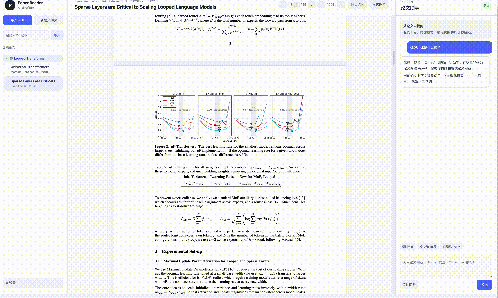

# Paper Reader

[English](README.md)



Paper Reader 是一个在本地运行的论文阅读Web应用。应用中可以通过文件夹树管理文献，同时支持使用AI助手进行论文解读、读图和翻译。论文文件、译文缓存和模型设置都写在本机目录里，整条阅读流程都在本地完成。

## 功能

- 支持导入本地 PDF，也支持粘贴 arXiv 的 `abs` 或 `pdf` 链接。支持文献元信息提取，若文件名或首页文本里带有 arXiv 编号，标题、作者、年份和摘要会从 arXiv 接口补全；否则会把首页文本交给 Pi，由它抽出同样的字段。
- 阅读器基于 PDF.js：页面纵向排布、可跳页、可缩放，并且直接在 PDF 上选择文字。需要配图时，打开「框选图片」即可把区域截下来，附到下一句提问里。
- 选区翻译走 OpenAI 兼容接口。翻译是独立的任务，因此结果写在阅读区下方，并将翻译结果缓存在本地，减少重复翻译的token消耗。
- 概括全文、精读当前章节、解释图表和自由提问都交给 Pi。回复会流式写出，并按 Markdown 渲染。

## 环境

- Node.js 22 或更新版本
- 已安装并完成登录的 [Pi](https://pi.dev)，因为阅读助手通过 Pi 命令行运行
- 若要使用选区翻译，还需要一个 OpenAI 兼容的接口

## 启动

```bash
npm install
npm run build
npm start
```

然后在浏览器打开 [http://127.0.0.1:3080](http://127.0.0.1:3080)。

翻译也可以在首次启动前用环境变量写好：

```bash
export TRANSLATION_BASE_URL="https://api.openai.com/v1"
export TRANSLATION_API_KEY="your-key"
export TRANSLATION_MODEL="gpt-4o-mini"
```

这些项，连同 Pi 的模型编号和思考强度，之后都可以在左侧栏底部的 **设置** 页里改。

## Pi agent

概括、精读、看图和普通问答会交给 [Pi](https://pi.dev)（Earendil 的 coding agent 命令行）。Paper Reader 以 JSON 模式拉起 Pi，按任务载入对应的 prompt template，再把模型输出流进右侧对话。翻译是另一条路径：它直接请求你配置的 chat-completions 接口，因此延迟更低，并且与 agent 会话分开。

模型登录、默认模型和思考强度由 Pi 自己管理；Paper Reader 只把设置页（或 `PI_MODEL` / `PI_THINKING`）里的值传过去。安装、`/login`、`/model` 以及其余 Pi 选项，请参考 [Pi 的配置说明](https://github.com/earendil-works/pi/blob/main/packages/coding-agent/docs/configuration.md)。

## 开发

接口和前端可以分开跑：

```bash
npm run dev:server
npm run dev:web
```

开发界面在 [http://127.0.0.1:5173](http://127.0.0.1:5173)，Vite 会把 `/api` 转到 `3080`。

`npm run build` 之后，可以用本机 Chrome 做一次界面检查：

```bash
node scripts/check-reader-ui.mjs path/to/paper.pdf
```

论文、翻译缓存和设置保存在 `.runtime/` 目录中。
